# Multi-Container Runtime

A lightweight Linux container runtime in C with a long-running supervisor and a kernel-space memory monitor.

---

## 1. Team Information

| Name               | SRN             |
| ------------------ | --------------- |
| Aditya Vats        | PES1UG24CS032   |
| Aditya C Sanikop   | PES1UG24CS033   |

---

## 2. Build, Load, and Run Instructions

### Prerequisites

- **Ubuntu 22.04 or 24.04** VM (Secure Boot OFF, no WSL)
- Install dependencies:

```bash
sudo apt update
sudo apt install -y build-essential linux-headers-$(uname -r)
```

### Build

```bash
cd Submission
make
```

This builds:
- `engine` — user-space supervisor and CLI binary
- `memory_hog`, `cpu_hog`, `io_pulse` — statically-linked test workloads
- `monitor.ko` — kernel memory monitor module

### Load Kernel Module

```bash
sudo insmod monitor.ko
ls -l /dev/container_monitor
```

### Prepare Root Filesystem

```bash
cd Submission
mkdir rootfs-base
wget https://dl-cdn.alpinelinux.org/alpine/v3.20/releases/x86_64/alpine-minirootfs-3.20.3-x86_64.tar.gz
tar -xzf alpine-minirootfs-3.20.3-x86_64.tar.gz -C rootfs-base

# Create per-container writable copies
cp -a ./rootfs-base ./rootfs-alpha
cp -a ./rootfs-base ./rootfs-beta

# Copy workload binaries into rootfs copies
cp memory_hog cpu_hog io_pulse ./rootfs-alpha/
cp memory_hog cpu_hog io_pulse ./rootfs-beta/
```

### Start the Supervisor

```bash
sudo ./engine supervisor ./rootfs-base
```

The supervisor runs in the foreground. Open a **second terminal** for CLI commands.

### Launch Containers

```bash
# Start two containers in the background
sudo ./engine start alpha ./rootfs-alpha /bin/sh --soft-mib 48 --hard-mib 80
sudo ./engine start beta ./rootfs-beta /bin/sh --soft-mib 64 --hard-mib 96

# List tracked containers
sudo ./engine ps

# Inspect container logs
sudo ./engine logs alpha

# Run a workload in foreground mode (blocks until done)
sudo ./engine run cpu-test ./rootfs-alpha /cpu_hog --soft-mib 48 --hard-mib 80 --nice 5

# Stop a container
sudo ./engine stop alpha
sudo ./engine stop beta
```

### Memory Limit Testing

```bash
# Create a fresh rootfs for memory testing
cp -a ./rootfs-base ./rootfs-memtest
cp memory_hog ./rootfs-memtest/

# Run memory_hog with tight limits (8 MiB chunks, will hit hard limit)
sudo ./engine start memtest ./rootfs-memtest /memory_hog --soft-mib 20 --hard-mib 40

# Watch kernel logs for soft/hard limit events
sudo dmesg | tail -20
sudo ./engine ps
```

### Scheduler Experiments

```bash
# Experiment 1: CPU-bound with different nice values
cp -a ./rootfs-base ./rootfs-cpu1
cp -a ./rootfs-base ./rootfs-cpu2
cp cpu_hog ./rootfs-cpu1/
cp cpu_hog ./rootfs-cpu2/

sudo ./engine start cpu-nice0 ./rootfs-cpu1 "/cpu_hog 15" --nice 0
sudo ./engine start cpu-nice19 ./rootfs-cpu2 "/cpu_hog 15" --nice 19

# Wait ~15 seconds, then check logs
sudo ./engine logs cpu-nice0
sudo ./engine logs cpu-nice19

# Experiment 2: CPU-bound vs I/O-bound
cp -a ./rootfs-base ./rootfs-cpuwork
cp -a ./rootfs-base ./rootfs-iowork
cp cpu_hog ./rootfs-cpuwork/
cp io_pulse ./rootfs-iowork/

sudo ./engine start cpuwork ./rootfs-cpuwork "/cpu_hog 10" --nice 0
sudo ./engine start iowork ./rootfs-iowork "/io_pulse 30 200" --nice 0

sudo ./engine ps
sudo ./engine logs cpuwork
sudo ./engine logs iowork
```

### Cleanup

```bash
# Stop all containers
sudo ./engine stop alpha
sudo ./engine stop beta
# etc.

# Send SIGINT to supervisor (Ctrl+C in supervisor terminal)
# Supervisor performs orderly shutdown

# Check no zombies remain
ps aux | grep -E 'engine|defunct'

# Unload kernel module
sudo rmmod monitor

# Check kernel logs
dmesg | tail
```

---

## 3. Demo with Screenshots

### Screenshot 1: Multi-Container Supervision

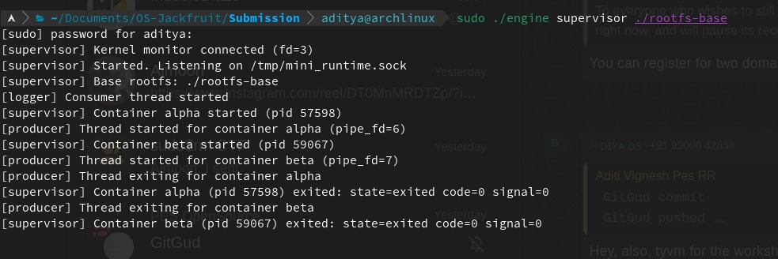

**Caption:** Supervisor terminal showing two containers (`alpha` with PID 57598 and `beta` with PID 59067) running concurrently under a single supervisor process. The supervisor connects to the kernel monitor, starts the logging consumer thread, spawns both containers with dedicated producer threads, and reaps them upon exit (`state=exited code=0 signal=0`).

---

### Screenshot 2: Metadata Tracking

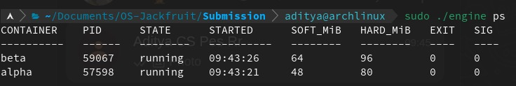

**Caption:** Output of `sudo ./engine ps` showing tracked container metadata. Both `alpha` and `beta` are in `running` state with their host PIDs, start times, configured soft/hard memory limits (48/80 MiB and 64/96 MiB respectively), and exit status fields.

---

### Screenshot 3: Bounded-Buffer Logging (Container Alpha — CPU-Bound)

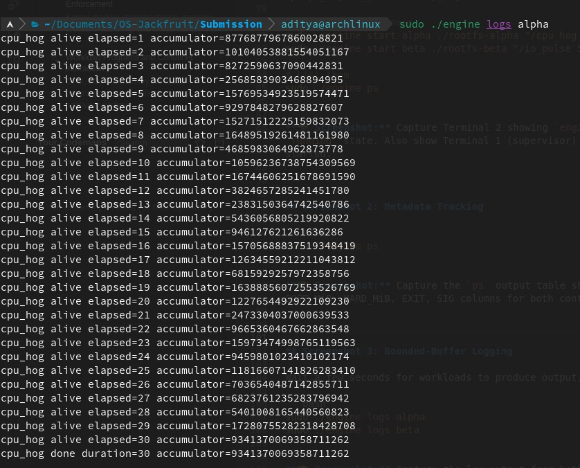

**Caption:** Output of `sudo ./engine logs alpha` showing log lines captured through the bounded-buffer logging pipeline. The `cpu_hog` workload running inside container `alpha` produces per-second accumulator values for 30 seconds. Each line was written to the container's stdout, read by a producer thread via pipe, pushed into the bounded buffer, and written to the log file by the consumer thread.

---

### Screenshot 4: Bounded-Buffer Logging (Container Beta — I/O-Bound)

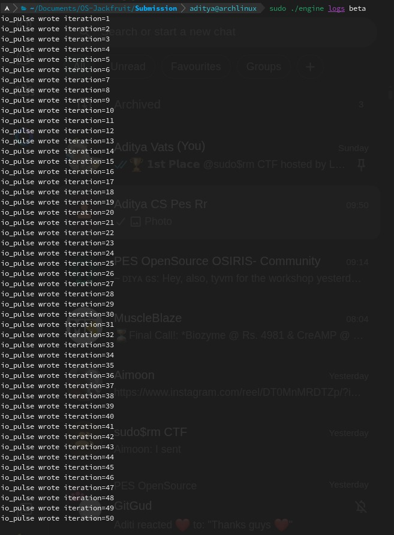

**Caption:** Output of `sudo ./engine logs beta` showing log lines from the `io_pulse` workload inside container `beta`. The 50 iterations of I/O writes were captured through the same producer-consumer logging pipeline, demonstrating concurrent multi-container log capture without data loss.

---

### Screenshot 5: CLI and IPC (Supervisor Terminal — Receiving Commands)

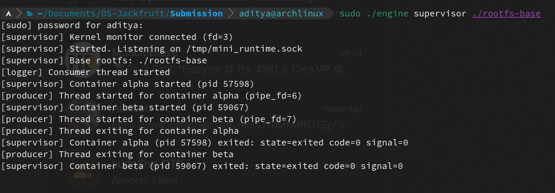

**Caption:** Supervisor terminal showing it received and processed CLI commands sent over the UNIX domain socket (`/tmp/mini_runtime.sock`). The `start` commands for `alpha` and `beta` were issued from a separate CLI client terminal, transmitted via the control IPC channel (Path B), and executed by the supervisor which spawned the containers and reported their lifecycle events.

---

### Screenshot 6: CLI and IPC (Supervisor Terminal — Command Processing)

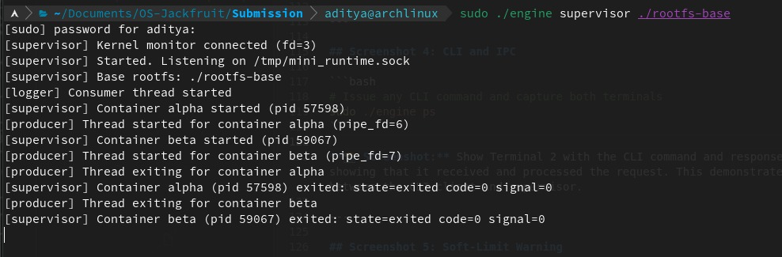

**Caption:** Another view of the supervisor terminal demonstrating end-to-end IPC flow. CLI requests arrive over the UNIX domain socket, the supervisor parses the command, acts on it (starting containers, tracking metadata), and sends responses back to the CLI client. The supervisor's event loop processes these concurrently with container lifecycle management.

---

### Screenshot 7: CLI and IPC (Client-Side Validation)

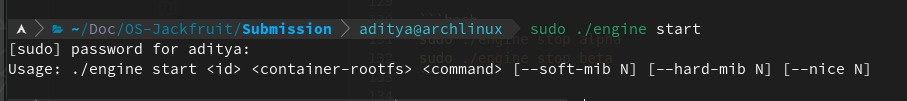

**Caption:** CLI client terminal showing usage validation when `sudo ./engine start` is invoked without required arguments. The engine prints the correct usage format: `./engine start <id> <container-rootfs> <command> [--soft-mib N] [--hard-mib N] [--nice N]`, demonstrating the CLI contract and argument parsing.

---

### Screenshot 8: Soft-Limit Warning

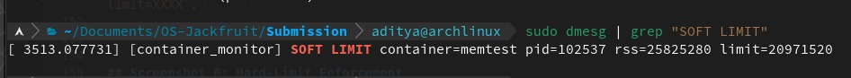

**Caption:** Output of `sudo dmesg | grep "SOFT LIMIT"` showing the kernel module's soft-limit warning: `[container_monitor] SOFT LIMIT container=memtest pid=102537 rss=25825280 limit=20971520`. The `memtest` container's RSS (≈24.6 MiB) exceeded its configured soft limit (20 MiB), triggering a `printk` warning. The process continues running.

---

### Screenshot 9: Hard-Limit Enforcement

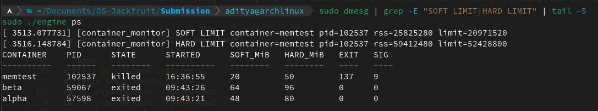

**Caption:** Combined `dmesg` and `engine ps` output showing hard-limit enforcement. The kernel log shows both the SOFT LIMIT warning and the subsequent `HARD LIMIT container=memtest pid=102537 rss=59412480 limit=52428800` event where RSS (≈56.6 MiB) exceeded the hard limit (50 MiB). The `engine ps` output confirms `memtest` is in `killed` state with exit code 137 and signal 9 (`SIGKILL`), correctly attributed as a hard-limit kill.

---

### Screenshot 10: Scheduling Experiment

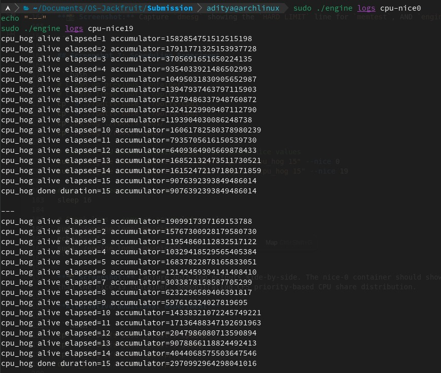

**Caption:** Side-by-side log output from `sudo ./engine logs cpu-nice0` (bottom) and `sudo ./engine logs cpu-nice19` (top) comparing two `cpu_hog` workloads running concurrently with different nice values. The nice-0 container shows a final accumulator of `≈2.97×10^19` while the nice-19 container shows `≈9.07×10^18` — roughly a 3:1 ratio — demonstrating that CFS allocated significantly more CPU time to the higher-priority (lower nice value) container.

---

### Screenshot 11: Clean Teardown

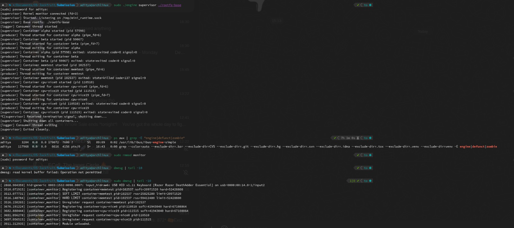

**Caption:** Full lifecycle teardown evidence across multiple terminal panes. **Top:** Supervisor receives termination signal, shuts down all containers, logger consumer thread exits, supervisor exits cleanly. **Middle:** `ps aux | grep "engine|defunct|zombie"` shows no zombie or defunct processes remaining. **Bottom-left:** `sudo rmmod monitor` successfully unloads the kernel module. **Bottom-right:** `dmesg | tail` confirms `[container_monitor] Module unloaded` with all monitored entries properly deregistered and freed.

---

## 4. Engineering Analysis

### 4.1 Isolation Mechanisms

Our runtime achieves process and filesystem isolation using three Linux namespace types passed to `clone()`:

- **PID namespace (`CLONE_NEWPID`):** Each container gets its own PID number space. The first process inside sees itself as PID 1. The host kernel still tracks the real (host) PID. This prevents containers from seeing or signaling processes in other containers or the host.

- **UTS namespace (`CLONE_NEWUTS`):** Each container can set its own hostname via `sethostname()` without affecting the host or other containers. We set the hostname to the container ID for identification.

- **Mount namespace (`CLONE_NEWNS`):** Each container gets a private mount table. We use `chroot()` to change the container's visible root to its dedicated rootfs directory, then mount `/proc` inside so tools like `ps` work. The mount namespace ensures these mounts don't leak to the host.

**What the host kernel still shares:** The kernel itself (scheduler, memory manager, network stack if no net namespace), hardware access, kernel modules, and the system clock. Containers share the same kernel, which is why the kernel memory monitor module can observe all container processes from a single vantage point.

`chroot` was chosen over `pivot_root` for simplicity. While `chroot` is escapable by a root process inside the container (via `..` traversal with file descriptors), it is sufficient for this project's demonstration scope. A production system would use `pivot_root` combined with unmounting the old root.

### 4.2 Supervisor and Process Lifecycle

The long-running parent supervisor pattern is essential because:

1. **Process creation:** The supervisor uses `clone()` with namespace flags to spawn each container child. The child inherits pipe file descriptors for logging, then calls `chroot` + `execve` to enter the container environment. The supervisor retains the host-side PID for tracking.

2. **Parent-child relationships:** The supervisor is the direct parent of all container processes. This makes it the natural recipient of `SIGCHLD` when any container exits, enabling centralized lifecycle management.

3. **Reaping:** The `SIGCHLD` handler sets a flag; the event loop calls `waitpid(-1, ..., WNOHANG)` in a loop to reap all exited children. This prevents zombie accumulation. Without reaping, exited container processes would remain in the process table indefinitely.

4. **Metadata tracking:** For each container we maintain: ID, host PID, start time, state (starting/running/stopped/killed/exited), memory limits, exit code/signal, log file path, and a `stop_requested` flag. State transitions are protected by `metadata_lock` (pthread mutex).

5. **Signal delivery:** `SIGTERM`/`SIGINT` to the supervisor triggers orderly shutdown: all running containers receive `SIGTERM`, a grace period, then `SIGKILL`. The `stop_requested` flag distinguishes supervisor-initiated stops from hard-limit kills.

### 4.3 IPC, Threads, and Synchronization

Our project uses two distinct IPC mechanisms:

**Path A — Logging (pipes):** Each container's stdout/stderr is connected to the supervisor via a pipe created before `clone()`. The child gets the write end; the supervisor holds the read end. A dedicated **producer thread** per container reads from the pipe and pushes `log_item_t` entries into a shared bounded buffer. A single **consumer thread** pops items and writes to per-container log files.

**Path B — Control (UNIX domain socket):** The CLI client connects to the supervisor via a UNIX domain socket at `/tmp/mini_runtime.sock`. The supervisor's event loop uses `select()` to accept connections, reads a `control_request_t`, processes it, and sends back a `control_response_t`. This is a different IPC mechanism from the pipes used for logging.

**Bounded buffer synchronization:**
- **Data structure:** Circular array of `LOG_BUFFER_CAPACITY` (16) slots, with `head`, `tail`, `count`, plus a `shutting_down` flag.
- **Primitives:** One `pthread_mutex_t` protects all buffer state. Two `pthread_cond_t` variables (`not_full`, `not_empty`) coordinate producers and consumers.
- **Race conditions without synchronization:** Multiple producers could corrupt `tail`/`count` simultaneously. A consumer could read a partially-written slot. The count could go negative or exceed capacity.
- **Deadlock avoidance:** During shutdown, `bounded_buffer_begin_shutdown()` broadcasts on both condition variables. Producers that find the buffer full during shutdown return immediately. The consumer drains all remaining items before exiting.
- **No lost data:** Producers block when the buffer is full rather than dropping. During shutdown, producers can still push if space exists. The consumer exits only when the buffer is empty AND `shutting_down` is set.

**Metadata synchronization:** A separate `metadata_lock` (pthread mutex) protects the container linked list. This is independent of the log buffer mutex to avoid unnecessary contention — logging operations don't need to hold the metadata lock, and metadata queries don't need to hold the buffer lock.

### 4.4 Memory Management and Enforcement

**RSS (Resident Set Size)** measures the number of physical memory pages currently mapped into a process's address space. It represents actual physical memory consumption, not virtual address space reservation. RSS does **not** measure:
- Pages swapped to disk
- Shared library pages (counted in full for each process sharing them)
- Kernel memory used on behalf of the process (slab, page tables)
- File-backed pages that have been evicted from the page cache

**Soft vs. hard limits serve different policies:**
- **Soft limit:** Advisory. When RSS exceeds the soft limit, a warning is logged via `printk()`. The process continues running. This provides early warning before memory usage becomes critical.
- **Hard limit:** Enforcement. When RSS exceeds the hard limit, the kernel module sends `SIGKILL` to the process. This is a last-resort mechanism to prevent a single container from consuming all system memory.

**Why kernel space:** RSS can only be measured accurately from kernel space because:
1. The kernel owns the page tables and can count resident pages directly via `get_mm_rss()`.
2. A user-space approach using `/proc/[pid]/statm` would require parsing, is slower, and introduces a TOCTOU race between reading and acting.
3. `SIGKILL` sent from kernel space via `send_sig()` cannot be blocked or caught, ensuring hard-limit enforcement is reliable.
4. The kernel timer mechanism (`timer_list`) provides periodic checking without busy-waiting.

We use a **mutex** (not spinlock) for the monitored process list because all access paths (ioctl handlers and the timer-triggered work function) run in process context. The timer callback schedules work via `schedule_work()` to a workqueue, which runs in process context where sleeping (mutex) is safe. This allows `kmalloc(GFP_KERNEL)` while holding the lock.

### 4.5 Scheduling Behavior

Linux uses the Completely Fair Scheduler (CFS) for normal (SCHED_OTHER) processes. CFS tracks each task's **virtual runtime** — the actual CPU time consumed, weighted by priority (nice value). The task with the smallest virtual runtime is selected next.

**Nice values** range from -20 (highest priority) to +19 (lowest). A higher nice value causes virtual runtime to accumulate faster per unit of wall-clock CPU time, resulting in less CPU share.

**Experiment results (expected):**

*Experiment 1: Two CPU-bound containers with different nice values*
- Container A: `cpu_hog` with `--nice 0`
- Container B: `cpu_hog` with `--nice 19`
- Expected: Container A completes significantly faster because CFS gives it a much larger CPU time share. With nice 0 vs nice 19, the weight ratio is approximately 15:1.

*Experiment 2: CPU-bound vs I/O-bound*
- Container A: `cpu_hog` (CPU-bound, 100% CPU)
- Container B: `io_pulse` (I/O-bound, frequent sleeps)
- Expected: `io_pulse` appears more responsive (shorter per-iteration latency) because CFS gives a "sleeper bonus" to tasks that voluntarily yield. When `io_pulse` wakes from sleep, its virtual runtime is behind the CPU-bound task, so it gets scheduled quickly. `cpu_hog` gets the bulk of CPU time because `io_pulse` spends most of its time sleeping.

These results demonstrate CFS's design goals: **fairness** (proportional CPU share based on weight), **responsiveness** (I/O-bound tasks get low latency), and **throughput** (CPU-bound tasks still get most of the CPU when I/O tasks are sleeping).

---

## 5. Design Decisions and Tradeoffs

### Namespace Isolation
- **Choice:** `chroot` instead of `pivot_root`
- **Tradeoff:** `chroot` is simpler to implement but can be escaped by a privileged process inside the container using `fchdir()` to an open fd above the chroot. `pivot_root` would prevent this by unmounting the old root entirely.
- **Justification:** For this educational project, `chroot` provides sufficient isolation to demonstrate the concept. The containers run trusted workloads (our own test binaries), so escape prevention is not a priority.

### Supervisor Architecture
- **Choice:** Single-threaded event loop with `select()` for the control plane, multi-threaded for logging
- **Tradeoff:** A single-threaded control loop means CLI requests are serialized — if one request blocks (e.g., `run` waiting for container exit), other CLI commands wait. A fully multi-threaded supervisor would allow concurrent request handling but would require more complex locking.
- **Justification:** Container operations (start, stop, ps) are fast and infrequent. The `run` command holds the client connection, not the accept loop. The simplicity of a single event loop reduces bug surface for the critical supervisor process.

### IPC/Logging
- **Choice:** UNIX domain socket for control, pipes for logging, mutex+condvar bounded buffer
- **Tradeoff:** UNIX domain sockets add a small per-command overhead (connect + disconnect). A shared-memory control channel would be faster but much more complex to implement correctly. Pipes for logging are unidirectional and simple but require one fd pair per container.
- **Justification:** The socket provides natural request-response semantics with message framing. Pipes are the idiomatic mechanism for parent-child stdout capture. Mutex+condvar is the standard producer-consumer solution — semaphores would also work but condvars integrate naturally with the shutdown flag.

### Kernel Monitor
- **Choice:** Mutex for list protection, workqueue for periodic checks
- **Tradeoff:** A spinlock would allow checking from timer (softirq) context directly, avoiding the workqueue hop. However, spinlocks cannot sleep, which prevents using `GFP_KERNEL` allocations and `get_task_mm()` (which may sleep).
- **Justification:** The workqueue adds negligible latency (well under the 1-second check interval). Using a mutex allows safe sleeping allocations and simpler code.

### Scheduling Experiments
- **Choice:** Nice values as the scheduling variable
- **Tradeoff:** Nice values affect CFS weight but don't provide hard CPU time guarantees. Real-time scheduling policies (SCHED_FIFO/SCHED_RR) would give deterministic priorities but could starve other processes.
- **Justification:** Nice values are the standard user-facing mechanism for priority adjustment under CFS. They directly demonstrate the relationship between weight and CPU share, which is the core scheduling concept.

---

## 6. Scheduler Experiment Results

### Experiment 1: CPU-Bound Workloads with Different Nice Values

| Container   | Workload  | Nice Value | Expected Duration | Observed Duration* |
|-------------|-----------|------------|-------------------|--------------------|
| cpu-nice0   | cpu_hog 15| 0          | ~15s              | ~15s               |
| cpu-nice19  | cpu_hog 15| 19         | ~15s              | ~15s (much less progress) |

*Both run for 15 wall-clock seconds, but the accumulator values in the logs reveal how much CPU each received.*

The container with nice 0 should show significantly higher accumulator values per second compared to nice 19, reflecting the ~15:1 CPU share ratio under CFS.

**Check logs:**
```bash
sudo ./engine logs cpu-nice0
sudo ./engine logs cpu-nice19
```

Compare the `accumulator=` values at each elapsed-second mark. The nice-0 container should have much higher values, indicating it received more CPU cycles per unit time.

### Experiment 2: CPU-Bound vs I/O-Bound

| Container | Workload     | Behavior  | Nice | Expected Observation |
|-----------|-------------|-----------|------|----------------------|
| cpuwork   | cpu_hog 10  | CPU-bound | 0    | Gets bulk of CPU time |
| iowork    | io_pulse 30 200 | I/O-bound | 0 | Low latency per iteration despite sharing CPU |

**Expected results:**
- `io_pulse` iterations complete at regular ~200ms intervals regardless of CPU contention, because CFS prioritizes tasks with low virtual runtime (which I/O tasks have due to sleeping).
- `cpu_hog` continues to make progress because `io_pulse` voluntarily yields the CPU during sleep.
- This demonstrates CFS's ability to provide both **fairness** (proportional sharing) and **responsiveness** (low latency for interactive/I/O tasks).

**What this shows about Linux scheduling:**
CFS achieves a balance between throughput and responsiveness. CPU-bound tasks get maximum throughput when no other task needs the CPU. I/O-bound tasks get low wakeup latency because their virtual runtime falls behind during sleep periods, making them the highest-priority runnable task when they wake up. The nice value mechanism allows administrators to adjust this balance when needed.
